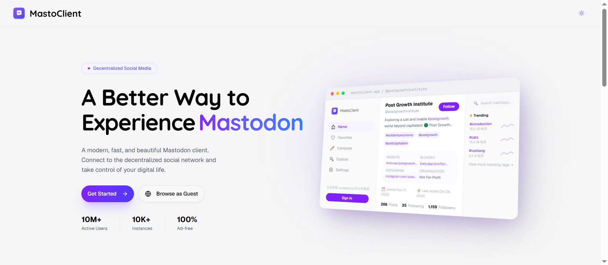
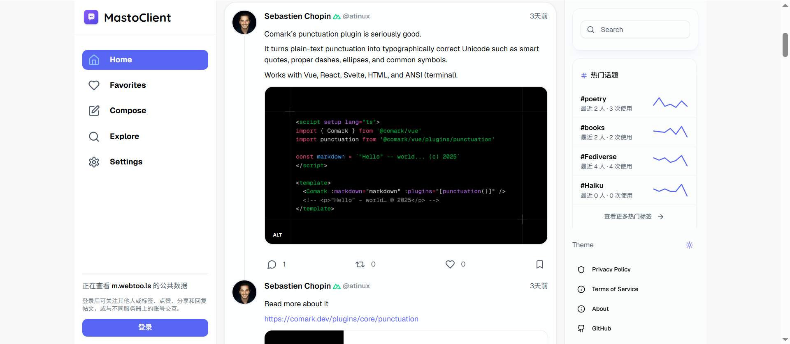

<p align="center">
  
</p>

<h1 align="center">Mastodon Client (Next.js)</h1>





一个基于 **Next.js App Router** 构建的 Mastodon Web Client，支持时间线浏览、收藏、发帖、探索与基础设置等功能。项目使用 **React Query** 做数据请求与缓存，并针对无限滚动与滚动位置恢复做了体验优化。

---

## Features

- **Home / Local / Public 时间线**
  - 时间线切换
  - 无限滚动加载
  - 滚动位置缓存与恢复（返回列表不“跳顶”）
- **Favorites（收藏）**
  - 收藏列表缓存（Infinite Query）
  - 支持分页加载
- **Compose（发帖）**
  - 基础发帖流程（依赖登录态）
- **Explore（探索）**
  - 探索内容聚合入口（可扩展为贴文、标签、最新、推荐关注等）
- **基础 UI 与体验优化**
  - Skeleton Loading
  - 组件化 StatusCard
  - 响应式布局

---

## Tech Stack

- **Framework:** Next.js (App Router) + React + TypeScript
- **Data Fetching / Cache:** `@tanstack/react-query`（支持 `useInfiniteQuery`）
- **Mastodon API:** `masto`
- **UI:** Tailwind CSS + shadcn/ui（Button/Badge/Card 等）
- **Deployment:** Vercel（与 v0.app 同步）

---

## Architecture Overview

> 以“页面 -> hooks -> API client -> React Query cache”为主链路组织。

- `app/**`：路由页面（Favorites / Explore / Timeline 等）
- `components/**`：UI 组件（`StatusCard`、`InfiniteScroller` 等）
- `hooks/mastodon/**`：业务数据 hooks（如 `useFavoritesCache`、`useTimelineCache`）
- `components/mastodon/infinite-scroller.tsx`
  - IntersectionObserver 触底加载
  - 可选 `scrollCacheKey` 用于滚动位置持久化/恢复

---

## Getting Started

### 1) Install
```bash
pnpm install
```

### 2) Run dev
```bash
pnpm run dev
```

打开：`http://localhost:3000`

---

## Deployment

项目可部署到 Vercel。
